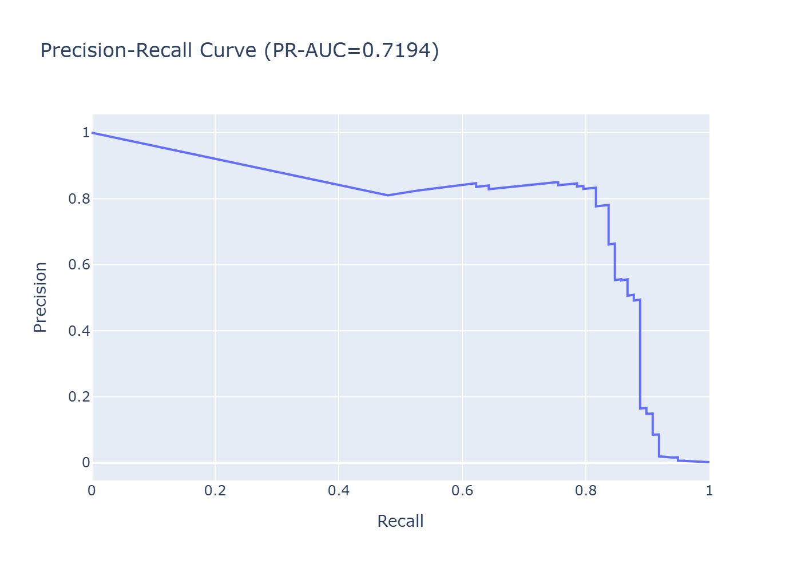
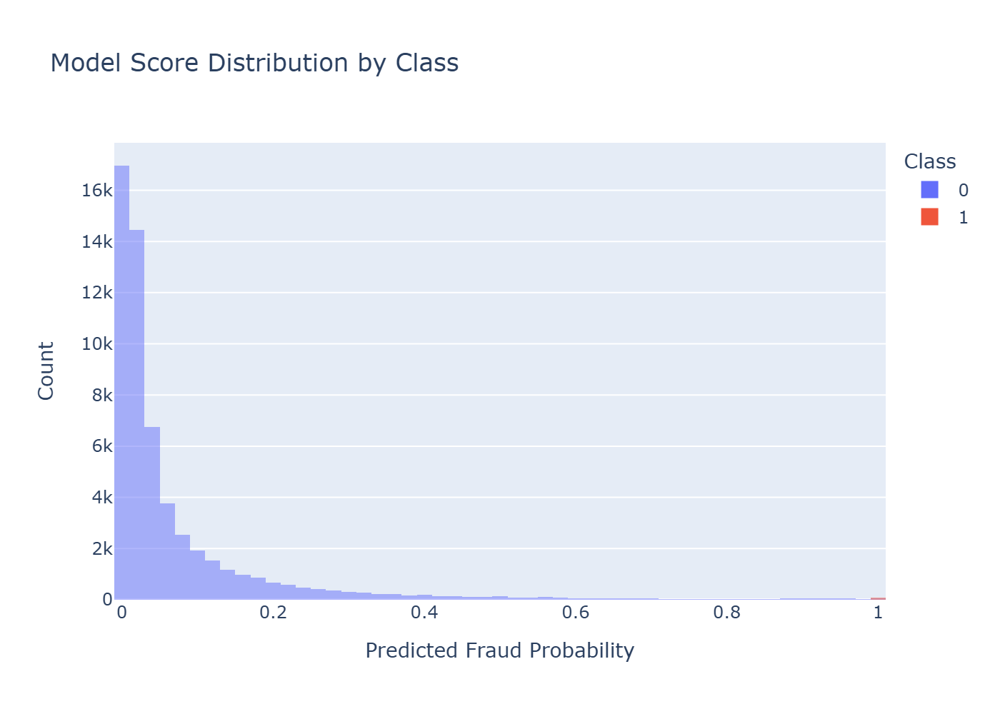
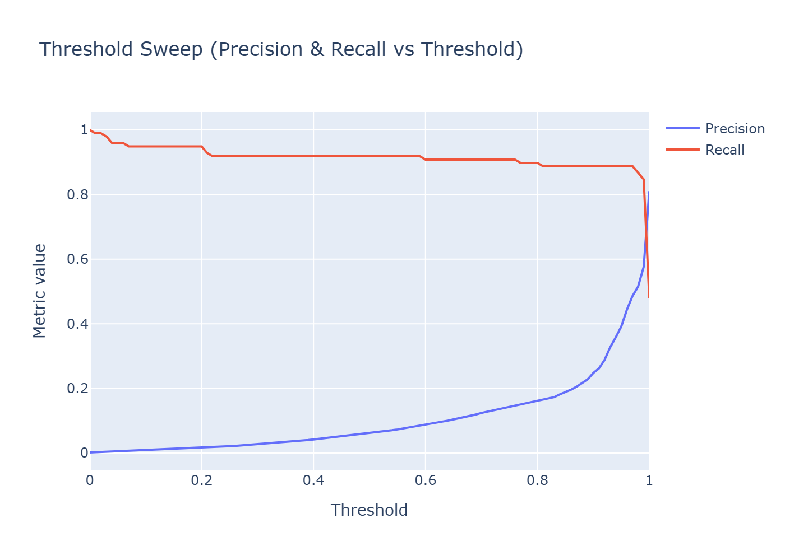
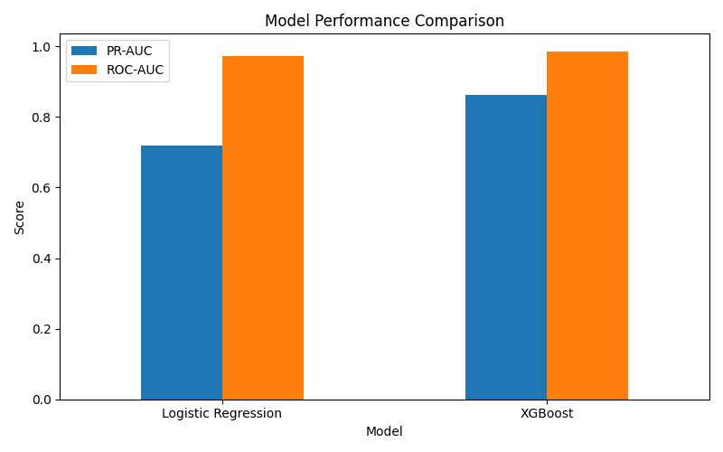
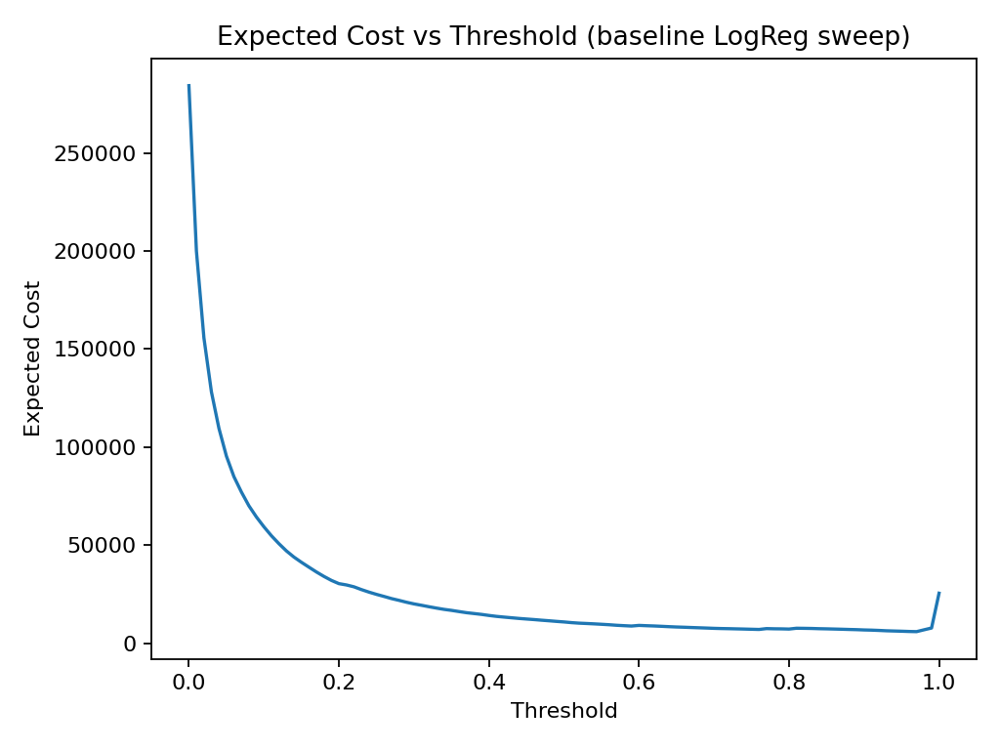
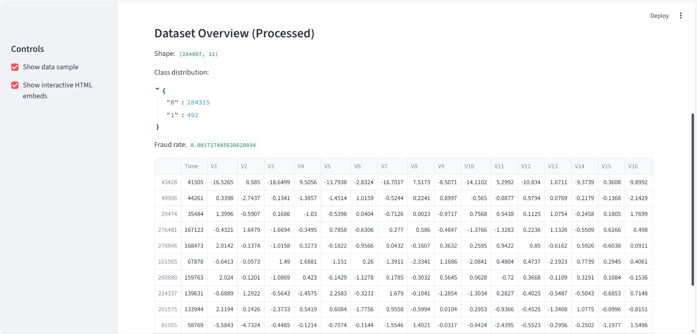
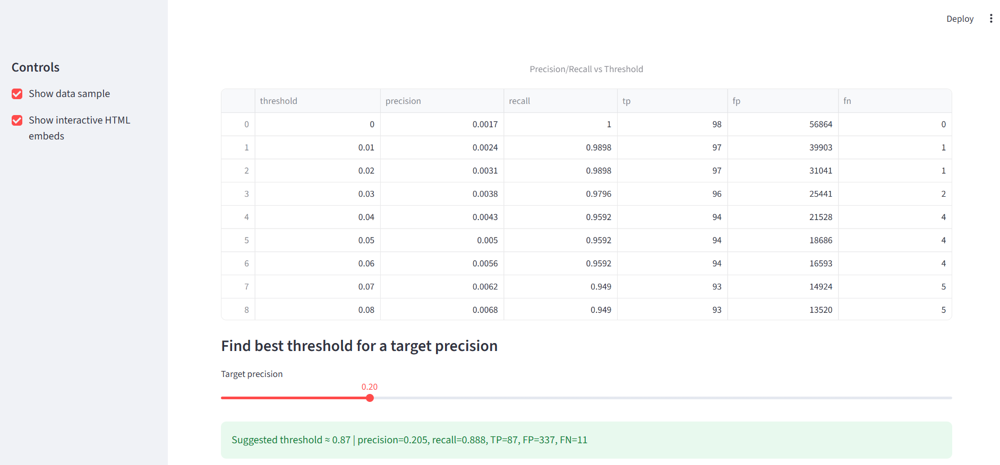
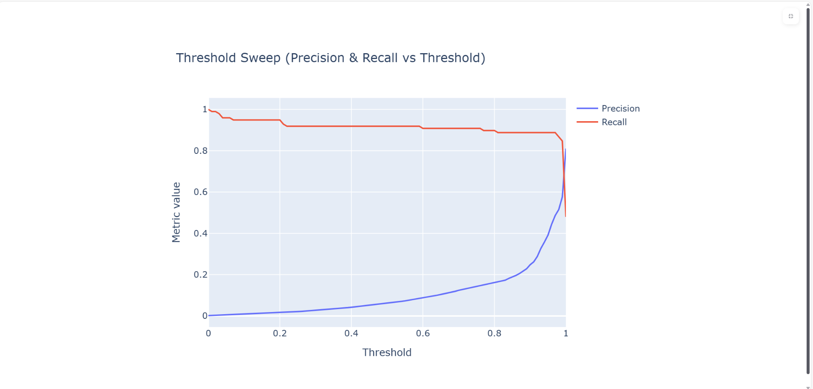
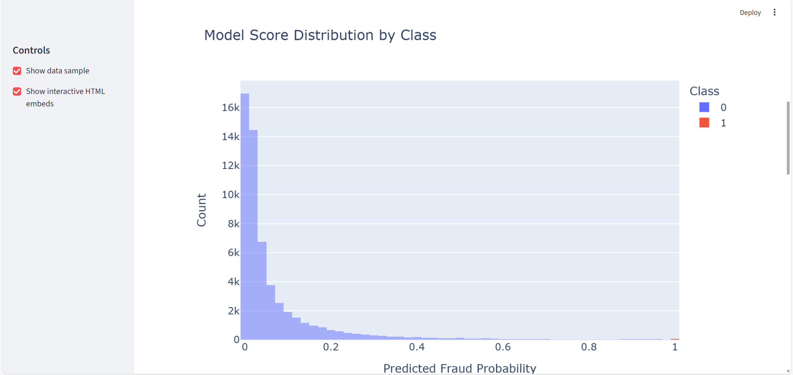

#  FinTech Fraud Detection Platform

**End-to-End Machine Learning System for Imbalanced Financial Fraud Detection**

---

##  Project Overview

This project demonstrates a **production-minded fraud detection pipeline** built using real-world FinTech practices.  
It focuses on **highly imbalanced transaction data**, operational decision-making, and **business-driven evaluation**.

The system covers the **full ML lifecycle**:

- Offline model training & evaluation  
- Model comparison (Logistic Regression vs XGBoost)  
- Cost-based threshold optimisation (business impact)  
- Interactive Streamlit dashboard for monitoring & analysis  

**Goal:** Detect fraudulent transactions while balancing **financial loss vs operational cost**.

---

##  Key Concepts Demonstrated

- Imbalanced classification (fraud < 1%)
- Precision–Recall optimisation (not accuracy)
- Threshold tuning & decision trade-offs
- Expected cost minimisation (FN vs FP)
- Model comparison & governance
- Reproducible ML experiments
- ML dashboards for stakeholders

---

##  Offline Evaluation Results

### Precision–Recall Curve  
*(Primary metric for imbalanced fraud data)*



---

### ROC Curve


---

### Score Distribution by Class



---

### Threshold Sweep (Precision vs Recall)



---

##  Model Comparison

**Logistic Regression vs XGBoost**



| Model | PR-AUC | ROC-AUC |
|------|--------|---------|
| Logistic Regression | ~0.72 | ~0.97 |
| XGBoost | ~0.86 | ~0.99 |

---

##  Cost-Based Threshold Optimisation

Instead of selecting a threshold purely on metrics, this project **minimises financial loss**:

- False Negative (missed fraud): **$500**
- False Positive (manual review): **$5**

**Optimal Result:**

- Threshold ≈ **0.97**
- Expected Cost ≈ **$5,960**
- Recall ≈ **0.89**



---

##  Streamlit Dashboard (Proof)

The Streamlit dashboard enables **interactive inspection** of:

- Model KPIs
- Threshold trade-offs
- Dataset composition
- Model comparison
- Cost-based decisioning

### Dashboard Overview


### Model Performance


### Threshold Tuning


### Dataset Overview


---

##  How to Run Locally

```bash
python -m venv .venv
source .venv/bin/activate   # Windows: .\.venv\Scripts\Activate.ps1
pip install -r requirements.txt
streamlit run dashboards/app.py
