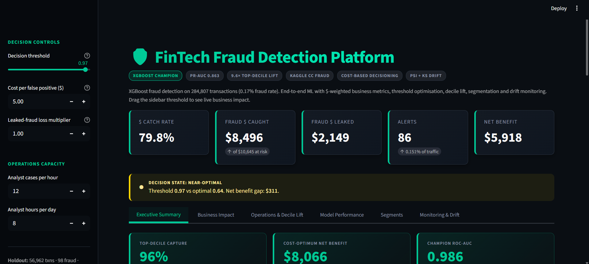
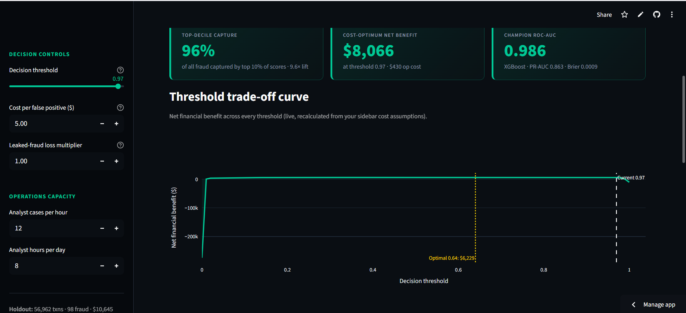
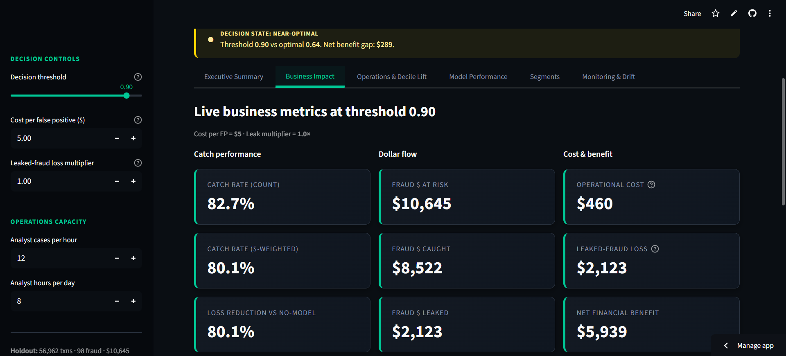
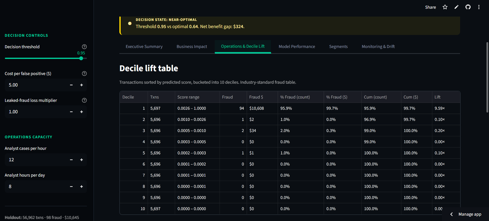
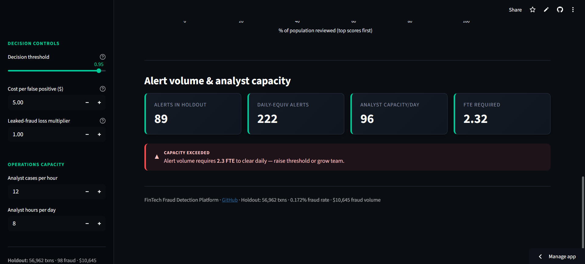
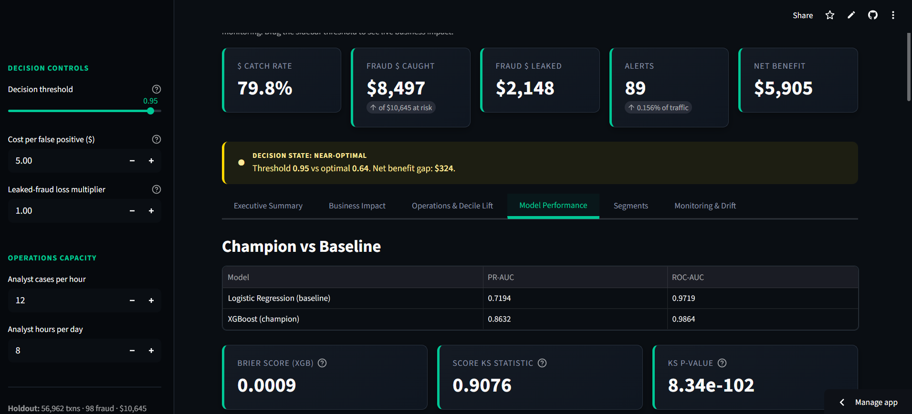
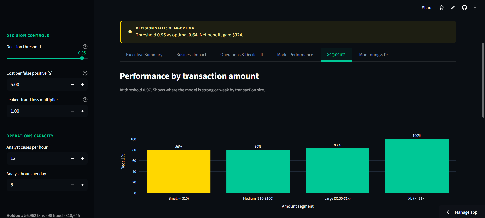
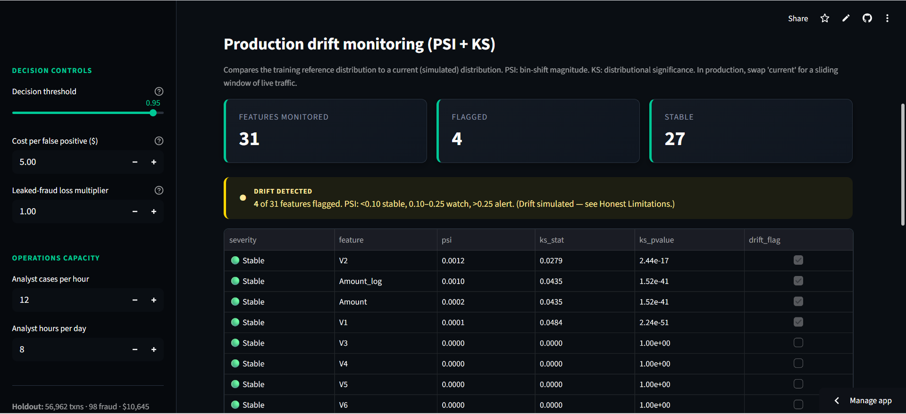
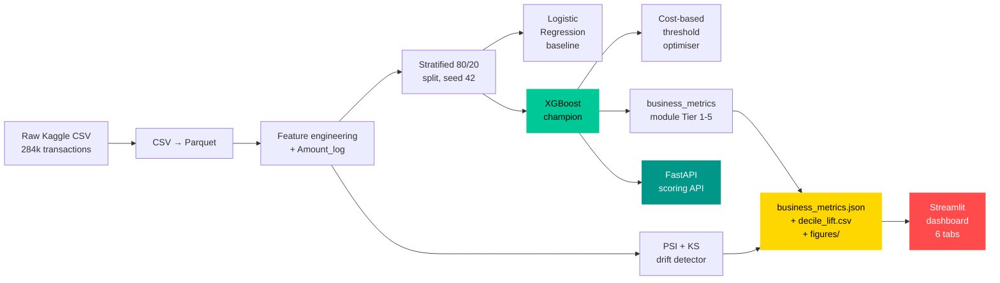

# 🛡️ FinTech Fraud Detection Platform

End-to-end ML system for imbalanced financial fraud detection — **XGBoost champion model** with **cost-based decisioning**, **$-weighted business metrics**, **decile lift analysis**, **segmentation**, and **PSI/KS drift monitoring**.

[](https://www.python.org/)
[](LICENSE)
[](https://fintech-fraud-detection.streamlit.app)
[](api/app.py)
[](src/models/train_xgb.py)
[](https://www.kaggle.com/datasets/mlg-ulb/creditcardfraud)

> **🚀 Live demo:** **[fintech-fraud-detection.streamlit.app](https://fintech-fraud-detection.streamlit.app)** — drag the threshold slider in the sidebar to see live business impact.



---

## 📊 Headline numbers

XGBoost champion at cost-optimum threshold **0.97**, evaluated on stratified 20% holdout:

| Metric | Value | Context |
|---|---|---|
| **$-weighted catch rate** | **79.8%** | $8,496 of $10,645 fraud volume caught |
| **Top-decile fraud capture** | **96%** | Top 10% of scores → 95.9% of all fraud · **9.6× lift** |
| **Net financial benefit** | **$8,066** | After $430 operational cost on 86 alerts |
| **Alert rate** | **0.15%** | 86 alerts of 56,962 transactions reviewed |
| **PR-AUC / ROC-AUC** | **0.863 / 0.986** | XGBoost champion |
| **Brier score** | **0.0009** | Probability calibration (lower is better) |
| **Score KS statistic** | **0.91** | Class separation (higher is better) |

Baseline for comparison: Logistic Regression PR-AUC 0.72 / ROC-AUC 0.97. The XGBoost lift in PR-AUC matters because PR is the right metric for imbalanced data (0.17% fraud rate).

---

## 🎯 What this is

A production-minded fraud detection pipeline on the Kaggle Credit Card Fraud benchmark (284,807 transactions, PCA-anonymized features, 0.17% fraud). The differentiator is the **business layer** stacked on top of the model: $-weighted metrics, cost-based threshold optimization, decile lift, segment performance, drift monitoring — the kind of output a fraud product team would actually use to make daily decisions.

**The full stack:**

- 🧪 **Offline training** — Logistic Regression baseline → XGBoost champion, stratified 80/20 split (`random_state=42`)
- 💰 **Cost-based decisioning** — every threshold ties to an explicit dollar outcome via configurable FP cost + leak multiplier
- 📈 **$-weighted business metrics** — fraud teams report in dollars, not just recall
- 🔬 **Decile lift table** — industry-standard concentration view
- 📡 **PSI + KS drift monitoring** — catches silent model decay
- 🖥️ **Interactive Streamlit dashboard** — threshold slider drives live recomputation of all business metrics from a pre-baked 101-point sweep
- ⚡ **FastAPI real-time scoring service** — production-style inference endpoint

---

## 🖼️ Dashboard walkthrough

The deployed Streamlit app has six tabs. Each is built to answer a specific question a fraud team would ask.

### Executive Summary — *"What's the state of the system right now?"*

Live KPIs at top, color-coded decision-state banner, hero callouts, and a threshold trade-off curve so you can see — in one screen — whether the current operating point is leaving money on the table.



### Business Impact — *"What's it worth in dollars at this threshold?"*

Drag the threshold slider in the sidebar; every metric recalculates live. Catch performance, dollar flow, and cost/benefit are surfaced separately so the trade-offs are explicit.



### Operations & Decile Lift — *"How concentrated is the fraud, and can my team handle the queue?"*

The decile lift table — sorted by score, bucketed into 10 — shows where the fraud actually lives. Top decile captures 95.9% of fraud with 9.6× lift. Below it: alert sizing and analyst capacity planning, with FTE math against your configured cases-per-hour.





### Model Performance — *"Is the model actually any good?"*

Champion vs Baseline comparison, Brier score for probability calibration, score KS for class separation, plus the full diagnostic plot set (PR/ROC, score distribution, threshold sweep, cost curve).



### Segments — *"Where is the model weak?"*

Performance by transaction amount and hour-of-day. Small transactions are the model's weakness here (yellow bar) — exactly the kind of honest segment view that informs whether to ensemble with a separate small-ticket model.



### Monitoring & Drift — *"Is the production world still the world the model was trained on?"*

Production-style drift monitoring with **PSI** (bin-shift magnitude) and **KS** (distributional significance). Color-coded severity flags per feature, with industry-standard thresholds (PSI <0.10 stable, 0.10–0.25 watch, >0.25 alert).



> ⚠️ *Drift here is simulated by perturbing a copy of the dataset to demonstrate the detection logic. In production this would compare a sliding window of live traffic against the training distribution.*

---

## 🏗️ Architecture


```mermaid
flowchart LR
    A[Raw Kaggle CSV<br/>284k transactions] --> B[CSV → Parquet]
    B --> C[Feature engineering<br/>+ Amount_log]
    C --> D[Stratified 80/20<br/>split, seed 42]
    D --> E1[Logistic<br/>Regression<br/>baseline]
    D --> E2[XGBoost<br/>champion]
    E2 --> F[Cost-based<br/>threshold<br/>optimiser]
    E2 --> G[business_metrics<br/>module Tier 1-5]
    G --> H[business_metrics.json<br/>+ decile_lift.csv<br/>+ figures/]
    H --> I[Streamlit<br/>dashboard<br/>6 tabs]
    E2 --> J[FastAPI<br/>scoring API]
    C --> K[PSI + KS<br/>drift detector]
    K --> H

    style E2 fill:#00C896,color:#000,stroke:#00C896
    style I fill:#FF4B4B,color:#fff,stroke:#FF4B4B
    style J fill:#009688,color:#fff,stroke:#009688
    style H fill:#FFD700,color:#000,stroke:#FFD700
```

Detailed design notes: [`docs/ARCHITECTURE.md`](docs/ARCHITECTURE.md) · field-level data contract: [`docs/data_contract.md`](docs/data_contract.md).

---

## 📁 Repository structure
fintech-fraud-detection-platform/
├── api/
│   └── app.py                          FastAPI real-time scoring endpoint
├── dashboards/
│   └── app.py                          Streamlit consultant-tier dashboard (6 tabs, ~750 lines)
├── data/
│   ├── raw/                            Kaggle CSV (gitignored)
│   ├── processed/                      Parquet (gitignored)
│   └── features/                       Engineered feature matrix (gitignored)
├── docs/
│   ├── ARCHITECTURE.md                 System design
│   ├── data_contract.md                Field definitions
│   └── screenshots/                    Dashboard screenshots in this README
├── models/                             Trained .joblib artifacts (gitignored)
├── monitoring/
│   ├── detect_drift.py                 PSI + KS drift detector
│   └── reports/                        Drift report snapshots (committed for cloud demo)
├── pipelines/
│   └── run_ingestion.ps1               Windows ingestion runner
├── reports/
│   ├── business_metrics.json           Tier 1-5 metrics + 101-point threshold sweep
│   ├── decile_lift_table.csv           Industry-standard decile table
│   ├── baseline_metrics.json           LR baseline
│   ├── xgb_metrics.json                XGBoost champion
│   ├── cost_threshold_optimum.json     Cost-based optimal threshold
│   └── figures/                        PR/ROC/cost/comparison plots + dashboard screenshots
└── src/
├── ingestion/                      Kaggle → Parquet pipeline
├── features/                       Feature engineering (Amount_log)
├── models/                         Train LR + XGB, cost optimiser, model comparison
├── analytics/                      ← business_metrics.py (the consulting layer)
└── validation/                     Schema checks for raw data

---

## 🚀 Run locally (Windows / PowerShell)

```powershell
# 1) Clone
git clone https://github.com/fahadamjad009/fintech-fraud-detection-platform.git
cd fintech-fraud-detection-platform

# 2) Virtual env (Python 3.11+)
python -m venv .venv
.\.venv\Scripts\Activate.ps1

# 3) Install dependencies
pip install -r requirements.txt

# 4) Get the dataset
#    Download 'creditcard.csv' from Kaggle and place at data/raw/creditcard.csv
#    https://www.kaggle.com/datasets/mlg-ulb/creditcardfraud

# 5) Run the pipeline (each step is idempotent)
python src/ingestion/convert_to_parquet.py        # CSV → data/processed/creditcard.parquet
python src/features/build_features.py             # → data/features/creditcard_features.parquet
python src/models/train_baseline_logreg.py        # → models/baseline_logreg.joblib
python src/models/train_xgb.py                    # → models/xgb.joblib
python src/models/cost_threshold_optimiser.py     # → reports/cost_threshold_optimum.json
python src/models/make_baseline_plots.py          # → reports/figures/*.png
python src/models/compare_models.py               # → reports/figures/model_comparison_auc.png
python monitoring/detect_drift.py                 # → monitoring/reports/data_drift_report.*
python -m src.analytics.business_metrics          # → reports/business_metrics.json + decile_lift_table.csv

# 6) Launch the Streamlit dashboard
streamlit run dashboards/app.py
# Opens at http://localhost:8501

# 7) (Optional) Launch the FastAPI scoring service
uvicorn api.app:app --reload --port 8000
# Swagger UI at http://localhost:8000/docs
```

---

## 🧮 The business metrics layer

`src/analytics/business_metrics.py` is the consulting differentiator. It recreates the XGBoost champion holdout and computes:

**Tier 1 — Business Impact**
- $-weighted catch rate (the metric fraud teams actually report)
- Fraud $ caught / leaked / total at risk
- Operational cost = alert volume × cost per FP
- Net financial benefit = caught − op cost − (leaked × multiplier)
- Approval & decline rates

**Tier 2 — Operations**
- Full decile lift table (industry standard)
- Cumulative gains (count + $-weighted)
- Alert volume + daily-equivalent + FTE capacity math

**Tier 3 — Model quality**
- Brier score (probability calibration)
- Score KS statistic (class separation)

**Tier 4 — Drift monitoring**
- PSI + KS per feature (see `monitoring/detect_drift.py`)

**Tier 5 — Segment performance**
- By transaction amount bucket (Small / Medium / Large / XL)
- By hour-of-day (24-hour profile)

**101-point threshold sweep**
- Every business metric pre-computed at thresholds 0.00 → 1.00 in 0.01 steps
- Enables the dashboard slider to do live recomputation without loading the model on Cloud (read-only against pre-baked JSON)

Outputs: `reports/business_metrics.json` (80 KB), `reports/decile_lift_table.csv`.

---

## ⚠️ Honest limitations

- **Benchmark data** — Kaggle Credit Card Fraud, PCA-anonymized V1–V28. Patterns are real but feature names are abstract.
- **9.6-hour holdout window** — the test set covers ~9.6 hours of transactions. Numbers in this README are **not annualized**.
- **Drift is simulated** — the monitoring tab perturbs a copy of the dataset to demonstrate detection logic. In production, replace "current" with a sliding window of live traffic.
- **Cost parameters are configurable** — the defaults ($5 per FP, 1.0× leak multiplier) are illustrative; adjust the dashboard sidebar to your unit economics.
- **No real-time scoring on Cloud** — the FastAPI scoring endpoint runs locally; the deployed Streamlit dashboard is read-only against pre-computed artifacts.
- **Single-table benchmark** — no external data joins, no graph features, no behavioral history.

---

## 🛠️ Tech stack

**ML & data**
Python 3.11 · XGBoost (champion) · scikit-learn (baseline + utilities) · pandas · NumPy · pyarrow · SciPy · joblib

**Apps & serving**
Streamlit (dashboard, deployed on Streamlit Community Cloud) · FastAPI + Uvicorn (scoring endpoint) · Plotly + Matplotlib (visualizations)

**Quality & ops**
Pydantic (request/response schemas) · python-dotenv (env config) · PSI + KS test (drift monitoring) · `pyproject.toml` PEP 621 metadata · MIT license

---

## 📜 License

MIT — see [LICENSE](LICENSE).

---

*Built by [Fahad Amjad](https://github.com/fahadamjad009). Designed to read as a fraud product team's actual operating tool, not a model card.*